### Hi there 👋

I really like  basketball, fluid dynamics, ML, building <3  

  

---

### 🧰 Languages & Tools

#### Languages

  
  
  
  
  
  
  

#### Tools, Platforms & Dev

  
  
  
  
  
  
  
  

#### ML / Data

  
  

#### CFD / Simulation

  
  
  

