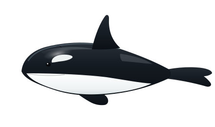
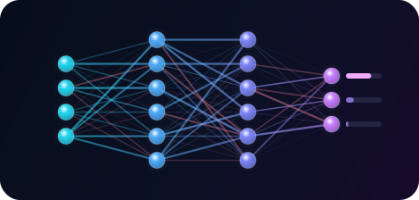

### Hi there 👋 

| (2) | (3) | (1) |
| :--- | :----: | ----: |
|  |  | 

---

### 📊 GitHub Stats

  

  
  

---

### 📅 Isometric Commit Calendar

---

### 🐍 Contribution Snake

  <picture>
    <source media="(prefers-color-scheme: dark)" srcset="https://raw.githubusercontent.com/Chefcurry4/Chefcurry4/output/github-contribution-grid-snake-dark.svg" />
    <source media="(prefers-color-scheme: light)" srcset="https://raw.githubusercontent.com/Chefcurry4/Chefcurry4/output/github-contribution-grid-snake.svg" />
    
  </picture>

---

### 🧰 Languages & Tools

#### Languages

  
  
  
  
  
  
  

#### Tools, Platforms & Dev

  
  
  
  
  
  
  
  

#### ML / Data

  
  

#### CFD / Simulation

  
  
  

